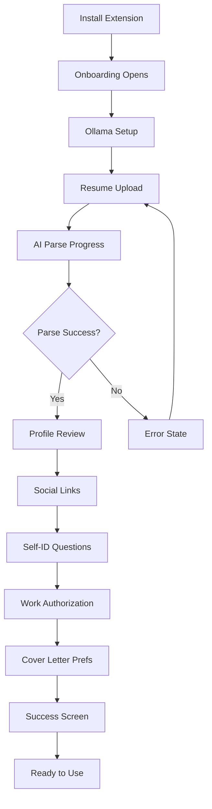
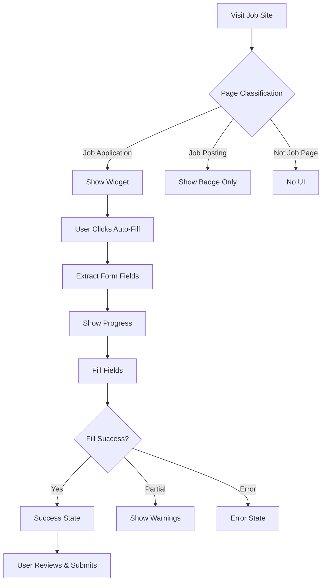
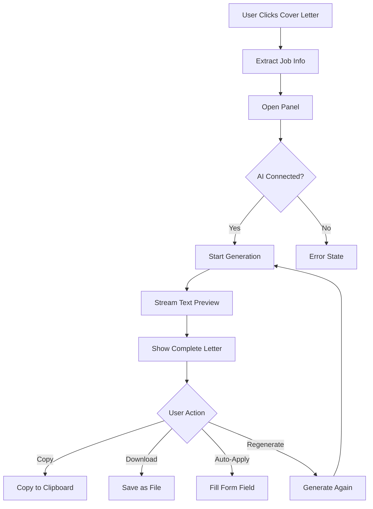
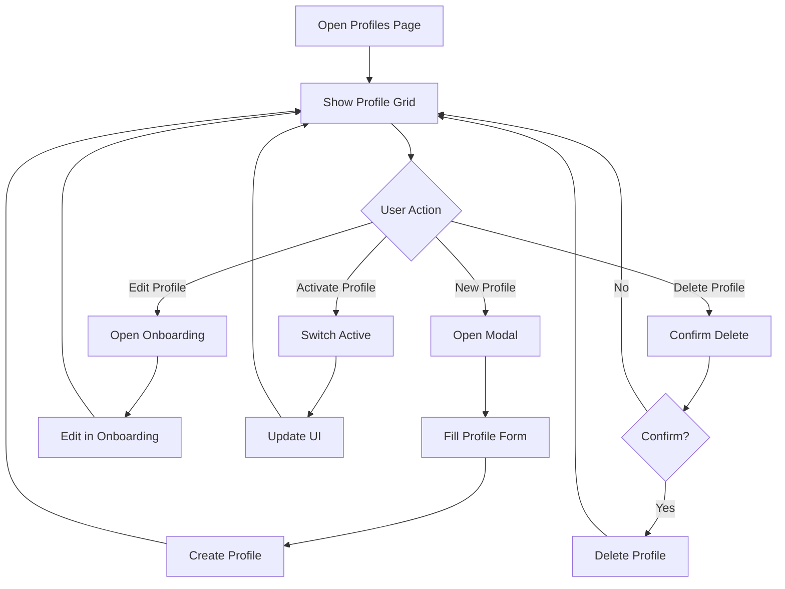

# Offlyn Apply - Complete UI Flow Audit

## 1. Product Overview

**Product:** Offlyn Apply - AI-powered browser extension for job application automation

**Core Purpose:** Helps job seekers automatically fill job application forms using AI, generate personalized cover letters, and track their application pipeline.

**Main User Jobs to be Done:**
- Auto-fill job application forms with personal data
- Generate AI-powered cover letters tailored to specific jobs
- Track and manage job applications in a pipeline
- Discover and search for relevant job opportunities
- Optimize resumes for specific job descriptions
- Manage multiple professional profiles for different roles

## 2. Route / Screen Inventory

### Primary Extension Surfaces

#### 2.1 Browser Popup (`popup/popup.html`)
- **Route:** Browser toolbar action popup
- **Purpose:** Main control center and navigation hub
- **Parent Flow:** Entry point for all extension functionality
- **Key UI Sections:**
  - Header: Logo, dark mode toggle, master enable switch
  - Profile switcher with dropdown (multi-profile support)
  - Job detection status bar
  - Profile completeness warning
  - New jobs notification banner
  - Primary actions: Auto-Fill, Generate Cover Letter
  - Navigation grid: Manage Profiles, Find Jobs, Tailor Resume, Dashboard, Chat, Data Explorer
  - Application statistics cards
  - Ollama AI connection status
  - Collapsible Advanced panel
  - Footer links: Home, Settings, Help, Privacy
- **Main Actions:** Enable/disable extension, switch profiles, trigger autofill, generate cover letter, navigate to other pages
- **Possible States:** Enabled/disabled, connected/disconnected AI, job detected/not detected, profile complete/incomplete, new jobs available/none
- **Components Used:** Profile switcher, job status bar, action buttons, stats cards, navigation grid

#### 2.2 Onboarding Wizard (`onboarding/onboarding.html`)
- **Route:** `/onboarding/onboarding.html?profileId=&edit=true`
- **Purpose:** Multi-step setup and profile management
- **Parent Flow:** First-time setup or profile editing
- **Key UI Sections:**
  - Progress indicator with step dots
  - Step containers: Ollama setup, Resume upload, Profile review, Links, Self-ID, Work auth, Cover letter prefs, Success
  - File upload area with drag-and-drop
  - Form fields for profile editing
  - Status messages and progress feedback
- **Main Actions:** Upload resume, configure AI, edit profile data, set preferences
- **Possible States:** Fresh setup, edit mode, learned values only, upload progress, parse success/error
- **Components Used:** Multi-step wizard, file upload, form components, progress indicators

#### 2.3 Job Discovery (`jobs/jobs.html`)
- **Route:** `/jobs/jobs.html`
- **Purpose:** Search and discover job opportunities
- **Parent Flow:** Job hunting workflow
- **Key UI Sections:**
  - Search form: keywords, location, date range, remote toggle
  - Tab bar: Results / Saved
  - Job cards grid with compatibility scores
  - Loading states and empty states
  - Sort and filter options
- **Main Actions:** Search jobs, save jobs, apply to jobs, sort by match percentage
- **Possible States:** Loading, results populated, empty results, saved jobs, search error
- **Components Used:** Search form, job cards, tabs, compatibility scoring

#### 2.4 Profile Management (`profiles/profiles.html`)
- **Route:** `/profiles/profiles.html`
- **Purpose:** Manage multiple professional profiles
- **Parent Flow:** Profile switching and CRUD operations
- **Key UI Sections:**
  - Active profile banner
  - Profile cards grid
  - New profile modal
  - Inline editing capabilities
- **Main Actions:** Create profile, edit profile, delete profile, activate profile, clone profile
- **Possible States:** Single profile, multiple profiles, creating new, editing existing
- **Components Used:** Profile cards, modal dialog, color picker, form inputs

#### 2.5 Resume Tailoring (`resume-tailor/resume-tailor.html`)
- **Route:** `/resume-tailor/resume-tailor.html`
- **Purpose:** AI-powered resume optimization for specific jobs
- **Parent Flow:** Job application preparation
- **Key UI Sections:**
  - Dual-panel layout: Resume text / Job description
  - Ollama connection status
  - Keyword analysis section
  - Tailored result panel
  - Export options
- **Main Actions:** Scrape job description, tailor resume, analyze keywords, export result
- **Possible States:** Empty, loaded, tailoring in progress, results ready, AI offline
- **Components Used:** Text areas, keyword badges, progress indicators, export buttons

#### 2.6 Application Dashboard (`dashboard/dashboard.html`)
- **Route:** `/dashboard/dashboard.html`
- **Purpose:** Track job applications in pipeline
- **Parent Flow:** Application management
- **Key UI Sections:**
  - Statistics overview
  - Kanban board by application status
  - Search and filter controls
  - Application edit modal
- **Main Actions:** View applications, edit status, delete applications, export data
- **Possible States:** Empty pipeline, populated board, editing application, loading
- **Components Used:** Kanban columns, application cards, modal forms, charts

### Content Script UI (Injected into Web Pages)

#### 2.7 Compatibility Widget (`src/ui/compatibility-widget.ts`)
- **Route:** Injected on job application pages
- **Purpose:** Primary floating UI for job application assistance
- **Parent Flow:** Job application workflow
- **Key UI Sections:**
  - Collapsed pill state
  - Expanded panel with actions
  - Compatibility score breakdown
  - Profile switcher
  - Fill progress ring
- **Main Actions:** Auto-fill forms, generate cover letter, switch profiles, refresh scan
- **Possible States:** Collapsed, expanded, filling in progress, compatibility shown/hidden
- **Components Used:** Shadow DOM host, accordion panels, progress rings

#### 2.8 Cover Letter Panel (`src/ui/cover-letter-panel.ts`)
- **Route:** Slide-in overlay on job pages
- **Purpose:** AI cover letter generation and preview
- **Parent Flow:** Cover letter creation workflow
- **Key UI Sections:**
  - Header with job info
  - Streaming text preview
  - Action buttons: Copy, Download, Auto-Apply, Regenerate
  - Error states
- **Main Actions:** Generate cover letter, refine content, copy text, download file, apply to form
- **Possible States:** Generating, preview ready, error, refining
- **Components Used:** Slide panel, streaming text, action buttons

### Secondary Pages

#### 2.9 Settings (`settings/settings.html`)
- **Route:** `/settings/settings.html`
- **Purpose:** Extension configuration and preferences
- **Parent Flow:** Configuration management
- **Key UI Sections:**
  - Extension toggles
  - Scheduled search settings
  - Ollama configuration
  - Data management
  - Danger zone actions
- **Main Actions:** Configure settings, test connections, clear data, export profile
- **Possible States:** Default, testing connection, clearing data, confirming destructive actions
- **Components Used:** Toggle switches, forms, confirmation dialogs

#### 2.10 Chat Interface (`chat/chat.html`)
- **Route:** `/chat/chat.html`
- **Purpose:** AI chat about resume and career
- **Parent Flow:** Career assistance
- **Key UI Sections:**
  - Welcome message with sample questions
  - Chat thread
  - Input area
  - Profile status indicator
- **Main Actions:** Ask questions, get AI responses, view conversation history
- **Possible States:** Welcome, chatting, loading response, offline, no profile
- **Components Used:** Chat bubbles, input field, status badges

#### 2.11 Data Explorer (`data/data.html`)
- **Route:** `/data/data.html`
- **Purpose:** View and analyze stored profile data
- **Parent Flow:** Data transparency and debugging
- **Key UI Sections:**
  - Tab navigation: Profile, Graph, RL patterns
  - Data visualization tables
  - Export options
- **Main Actions:** Browse data, export information, understand AI decisions
- **Possible States:** Loading, populated, empty sections
- **Components Used:** Tabs, data tables, visualization cards

## 3. User Flows

### 3.1 First-Time Setup Flow
**Goal:** Get new user from installation to ready-to-use state
**Entry Points:** Extension installation, onboarding link from popup
**Preconditions:** Extension installed, no existing profile

**Step-by-step sequence:**
1. **Installation Screen** → Auto-opens onboarding in new tab
2. **Ollama Setup** → Configure AI connection, optional native helper
3. **Resume Upload** → Drag/drop or select PDF/DOC file
4. **Parse Progress** → AI extracts data with progress indicator and tips
5. **Profile Review** → Edit extracted information, add missing details
6. **Social Links** → Add LinkedIn, portfolio, GitHub links
7. **Self-ID Questions** → Optional demographic information
8. **Work Authorization** → Visa status and work eligibility
9. **Cover Letter Preferences** → Set tone and style preferences
10. **Success Screen** → Setup complete, ready to use

**Branches:**
- Parse failure → Error message with retry option
- Existing profile → Skip to profile review step
- Ollama connection failure → Manual configuration options

**Success State:** Profile created, AI connected, ready for job applications
**Error States:** Upload failure, parse error, AI connection issues
**Exit Points:** Close tab (saves progress), complete setup

### 3.2 Job Application Flow
**Goal:** Auto-fill job application form with personalized data
**Entry Points:** Job application page detected, popup auto-fill button, widget auto-fill
**Preconditions:** Profile exists, on job application page

**Step-by-step sequence:**
1. **Page Detection** → Content script classifies page as job application
2. **Widget Appearance** → Compatibility widget shows with field count
3. **Field Analysis** → Extract form schema, show compatibility score
4. **Auto-Fill Trigger** → User clicks auto-fill button
5. **Progress Display** → Show progress bar and field highlighting
6. **Form Population** → Fill fields with profile data and AI suggestions
7. **Validation** → Check required fields, show success/error states
8. **Completion** → Show summary of filled fields

**Branches:**
- No fields detected → Warning message, manual detection option
- Partial fill → Show which fields couldn't be filled
- Validation errors → Highlight problematic fields

**Success State:** Form completely filled, ready for review and submission
**Error States:** No fields found, fill failures, validation errors
**Exit Points:** Form submitted, user navigates away, widget closed

### 3.3 Cover Letter Generation Flow
**Goal:** Create personalized cover letter for specific job
**Entry Points:** Widget cover letter button, popup cover letter button
**Preconditions:** Profile exists, job information available

**Step-by-step sequence:**
1. **Job Analysis** → Extract job title, company, description
2. **Panel Opening** → Cover letter panel slides in from right
3. **Generation Start** → Show generating state with spinner
4. **Streaming Preview** → Display cover letter text as it's generated
5. **Result Display** → Show complete cover letter with actions
6. **User Actions** → Copy, download, auto-apply, or regenerate

**Branches:**
- AI offline → Error state with connection instructions
- Generation failure → Error message with retry option
- Refine request → Additional generation with modifications

**Success State:** Cover letter generated and ready for use
**Error States:** AI connection failure, generation error, no job context
**Exit Points:** Panel closed, cover letter applied, user navigates away

### 3.4 Job Discovery Flow
**Goal:** Find relevant job opportunities matching user profile
**Entry Points:** Popup "Find Jobs" button, widget "Open Jobs" link
**Preconditions:** Profile exists for compatibility scoring

**Step-by-step sequence:**
1. **Jobs Page Load** → Open jobs page in new tab
2. **Search Form** → Enter keywords, location, filters
3. **Search Execution** → Query multiple job sources
4. **Results Display** → Show jobs with compatibility scores
5. **Job Actions** → Save jobs or apply directly
6. **Tab Switching** → View saved jobs separately

**Branches:**
- No results → Empty state with search suggestions
- Search error → Error message with retry option
- Saved jobs → Switch to saved tab, manage saved items

**Success State:** Relevant jobs found and displayed with scores
**Error States:** Search failure, no results, API errors
**Exit Points:** Tab closed, navigate to external job site

### 3.5 Profile Management Flow
**Goal:** Create, edit, or switch between multiple professional profiles
**Entry Points:** Popup profile switcher, "Manage Profiles" link
**Preconditions:** At least one profile exists

**Step-by-step sequence:**
1. **Profiles Page** → Display all profiles in grid layout
2. **Profile Actions** → Activate, edit, or delete existing profiles
3. **New Profile Creation** → Modal with name, role, color selection
4. **Profile Editing** → Opens onboarding in edit mode
5. **Profile Switching** → Set active profile, update UI

**Branches:**
- Single profile → Simplified UI, no switching needed
- Clone profile → Copy existing profile as starting point
- Delete confirmation → Confirm destructive action

**Success State:** Profiles managed successfully, active profile set
**Error States:** Creation failure, edit conflicts, deletion errors
**Exit Points:** Return to previous page, close tab

### 3.6 Resume Tailoring Flow
**Goal:** Optimize resume for specific job description
**Entry Points:** Popup "Tailor Resume" button, widget tailor link
**Preconditions:** Profile with resume exists, job description available

**Step-by-step sequence:**
1. **Tailor Page Load** → Open resume tailor in new tab
2. **Content Loading** → Pre-fill job description if scraped from current tab
3. **Manual Input** → User can edit job description or resume text
4. **AI Processing** → Generate tailored resume and keyword analysis
5. **Results Display** → Show optimized resume with keyword gaps
6. **Export Options** → Copy text or export as PDF

**Branches:**
- No job description → Manual input required
- AI offline → Disable tailor functionality
- Keyword analysis → Show missing vs present keywords

**Success State:** Resume tailored and ready for use
**Error States:** AI connection failure, processing error, no content
**Exit Points:** Close tab, export completed, navigate away

### 3.7 Application Tracking Flow
**Goal:** Monitor and manage job application pipeline
**Entry Points:** Popup "Dashboard" button, application submission detection
**Preconditions:** Applications exist in system

**Step-by-step sequence:**
1. **Dashboard Load** → Display Kanban board with application statuses
2. **Status Overview** → Show statistics and charts
3. **Application Management** → Edit, delete, or update applications
4. **Pipeline Tracking** → Move applications between status columns
5. **Data Export** → Export application data for external use

**Branches:**
- Empty dashboard → Show empty state with getting started tips
- Edit application → Modal with form fields
- Bulk actions → Select multiple applications for batch operations

**Success State:** Applications tracked and organized effectively
**Error States:** Load failure, edit conflicts, export errors
**Exit Points:** Close tab, navigate to other pages

## 4. Modal / Overlay Flows

### 4.1 New Profile Modal (Profiles Page)
**Trigger:** "New Profile" button on profiles page
**Contents:** Name field, role field, color picker, clone option dropdown
**Actions:** Create, Cancel
**Navigation:** Success → Close modal, refresh grid; Cancel → Close modal

### 4.2 Application Edit Modal (Dashboard)
**Trigger:** Edit button on application card
**Contents:** Job title, company, status dropdown, notes, application date
**Actions:** Save, Delete, Cancel
**Navigation:** Save → Update card, close modal; Delete → Confirm, remove card

### 4.3 Cover Letter Panel (Content Script)
**Trigger:** Cover letter button in widget or popup
**Contents:** Job info header, streaming text area, action buttons
**Actions:** Copy, Download, Auto-Apply, Regenerate, Close
**Navigation:** Actions → Toast feedback; Close → Hide panel

### 4.4 Compatibility Widget Panel (Content Script)
**Trigger:** Click on collapsed widget pill
**Contents:** Field count, compatibility score, profile switcher, actions
**Actions:** Auto-Fill, Cover Letter, Refresh, Switch Profile, Collapse
**Navigation:** Actions → Trigger respective flows; Collapse → Return to pill state

### 4.5 Confirmation Dialogs (Various Pages)
**Trigger:** Destructive actions (delete profile, clear data, reset settings)
**Contents:** Warning message, action description, confirmation buttons
**Actions:** Confirm, Cancel
**Navigation:** Confirm → Execute action; Cancel → Return to previous state

### 4.6 Toast Notifications (Content Script)
**Trigger:** Various user actions and system events
**Contents:** Title, message, icon, auto-dismiss timer
**Actions:** Dismiss (optional close button)
**Navigation:** Auto-dismiss after timeout or manual close

### 4.7 Feature Tour Overlay (Popup)
**Trigger:** First-time popup open or tour restart
**Contents:** Highlighted elements, tooltip explanations, navigation
**Actions:** Next, Previous, Skip Tour, Complete
**Navigation:** Step through guided tour or skip to end

## 5. State Matrix

### 5.1 Browser Popup States
- **Default:** Extension enabled, profile loaded, no job detected
- **Loading:** Fetching state from background script every 3 seconds
- **Empty:** No profile exists or profile incomplete
- **Error:** Background script communication failure
- **Success:** Job detected, profile complete, AI connected
- **Disabled:** Extension toggle off, actions disabled
- **Validation:** Profile completeness check, warnings displayed
- **Permission-restricted:** N/A (no permission levels)

### 5.2 Onboarding Wizard States
- **Default:** Fresh setup, step 1 (Ollama configuration)
- **Loading:** File upload progress, AI parsing, connection testing
- **Empty:** No file uploaded, empty form fields
- **Error:** Upload failure, parse error, connection failure
- **Success:** Step completion, final success screen
- **Disabled:** Next button disabled until requirements met
- **Validation:** Form field validation, required field highlighting

### 5.3 Job Discovery Page States
- **Default:** Empty search form, no results
- **Loading:** Search in progress, skeleton cards
- **Empty:** No search results, empty saved jobs
- **Error:** Search API failure, connection issues
- **Success:** Results populated with compatibility scores
- **Disabled:** Search disabled during loading
- **Validation:** Search form validation, required fields

### 5.4 Content Script Widget States
- **Default:** Collapsed pill on job application pages
- **Loading:** Field detection in progress, compatibility calculation
- **Empty:** No fields detected, manual detection prompt
- **Error:** Detection failure, fill errors, validation issues
- **Success:** Fields detected and filled successfully
- **Disabled:** Extension disabled, no profile available
- **Validation:** Form validation during auto-fill process

### 5.5 Cover Letter Panel States
- **Default:** Closed/hidden state
- **Loading:** Generation in progress, streaming text
- **Empty:** No job context available for generation
- **Error:** AI connection failure, generation error
- **Success:** Cover letter generated and displayed
- **Disabled:** AI offline, no profile available
- **Validation:** Content refinement, user modifications

## 6. Reusable Components and Patterns

### 6.1 Navigation Elements
- **Profile Switcher:** Dropdown with profile dots, names, and roles
- **Tab Bar:** Results/Saved tabs in jobs page, data explorer tabs
- **Breadcrumb Navigation:** Step indicators in onboarding wizard
- **Footer Links:** Consistent footer across extension pages

### 6.2 Cards and Containers
- **Job Cards:** Title, company, location, salary, compatibility score
- **Profile Cards:** Name, role, color dot, actions (activate/edit/delete)
- **Application Cards:** Job info, status, dates, actions
- **Stat Cards:** Numerical displays with labels and icons

### 6.3 Forms and Inputs
- **Search Forms:** Keywords, location, filters, toggles
- **Profile Forms:** Text inputs, textareas, file uploads
- **Settings Forms:** Toggles, dropdowns, text inputs
- **Modal Forms:** Compact forms within dialog containers

### 6.4 Action Elements
- **Primary Buttons:** Auto-Fill, Generate Cover Letter, Search
- **Secondary Buttons:** Cancel, Close, Back, Skip
- **Icon Buttons:** Edit, Delete, Refresh, Settings
- **Toggle Switches:** Enable/disable, preferences, filters

### 6.5 Feedback and Status
- **Progress Indicators:** Linear progress bars, circular progress rings
- **Status Badges:** Connection status, compatibility scores, application status
- **Toast Notifications:** Success, error, warning, info messages
- **Loading States:** Spinners, skeleton screens, progress text

### 6.6 Data Display
- **Tables:** Data explorer, application lists
- **Charts:** Dashboard statistics, compatibility breakdowns
- **Lists:** Saved jobs, application pipeline
- **Grids:** Profile cards, job results

### 6.7 Overlays and Panels
- **Modal Dialogs:** Profile creation, application editing
- **Slide Panels:** Cover letter generation, suggestions
- **Floating Widgets:** Compatibility widget, tracking badge
- **Dropdown Menus:** Profile switcher, action menus

## 7. Figma Handoff Structure

### Page 1: Sitemap / Information Architecture
- Extension page hierarchy and relationships
- Content script UI overlay system
- Navigation flow between pages
- Entry points and exit points

### Page 2: End-to-End User Flows
- First-time setup journey (8 screens)
- Job application workflow (6 screens)
- Cover letter generation flow (4 screens)
- Job discovery process (5 screens)
- Profile management flow (4 screens)

### Page 3: Screen Inventory
- All 13 extension pages with annotations
- Content script UI components
- Modal and overlay variations
- State variations for each screen

### Page 4: Components and Patterns
- Design system components
- Reusable UI patterns
- Icon library and usage
- Typography and color specifications

### Page 5: States and Edge Cases
- Loading states for all components
- Error states and messaging
- Empty states and onboarding
- Validation states and feedback

### Page 6: Click-Through Prototype Recommendations
- Primary user journey prototype
- Key interaction patterns
- Micro-interactions and animations
- Responsive behavior notes

## 8. Mermaid Diagrams

### 8.1 First-Time Setup Flow

### 8.2 Job Application Flow

### 8.3 Cover Letter Generation Flow

### 8.4 Profile Management Flow

## 9. Final Deliverables

### A. Master Flow Map
The extension operates on two primary surfaces:
1. **Extension Pages:** Traditional web pages opened in browser tabs
2. **Content Script UI:** Injected overlays on job application websites

**Primary User Journeys:**
- Setup → Onboarding → Profile Creation → Ready State
- Job Hunting → Discovery → Application → Tracking
- Daily Use → Detection → Auto-Fill → Cover Letter → Submit

### B. Screen Inventory Table

| Screen | Type | Purpose | Key Actions | States |
|--------|------|---------|-------------|---------|
| Popup | Extension | Control center | Navigate, auto-fill, switch profiles | Default, loading, disabled |
| Onboarding | Extension | Setup wizard | Upload, configure, edit profile | Steps 1-8, success, error |
| Jobs | Extension | Job discovery | Search, save, apply | Loading, results, empty |
| Profiles | Extension | Profile management | Create, edit, delete, activate | Grid, modal, editing |
| Resume Tailor | Extension | Resume optimization | Scrape, tailor, export | Empty, processing, results |
| Dashboard | Extension | Application tracking | View, edit, delete, export | Empty, populated, editing |
| Settings | Extension | Configuration | Toggle, configure, test | Default, testing, clearing |
| Chat | Extension | AI assistance | Ask, respond, history | Welcome, chatting, offline |
| Data Explorer | Extension | Data transparency | Browse, export | Loading, populated, empty |
| Widget | Content Script | Job assistance | Auto-fill, cover letter | Collapsed, expanded, active |
| Cover Letter Panel | Content Script | Letter generation | Generate, copy, apply | Generating, ready, error |
| Notifications | Content Script | Feedback system | Inform, dismiss | Success, error, warning |

### C. Figma-Ready Feature Grouping

**Core Features:**
- Job Application Automation (Widget, Auto-fill, Progress)
- AI Cover Letter Generation (Panel, Streaming, Actions)
- Profile Management (Switcher, CRUD, Multi-profile)
- Job Discovery (Search, Results, Compatibility)

**Supporting Features:**
- Onboarding & Setup (Wizard, Upload, Configuration)
- Application Tracking (Dashboard, Pipeline, Analytics)
- Resume Optimization (Tailor, Keywords, Export)
- Settings & Configuration (Preferences, AI Setup, Data)

**Utility Features:**
- AI Chat Interface (Questions, Responses, History)
- Data Explorer (Transparency, Export, Debug)
- Help & Support (Documentation, Privacy, About)

### D. Missing Screens or UX Gaps Inferred from Code

**Identified Gaps:**
1. **Job Detected Page:** Partially implemented - `GET_JOB_FOR_TAB` handler missing in background script
2. **Dry Run Mode:** UI exists but not fully wired through to auto-fill functionality
3. **Extension Disable State:** Toggle exists but content script may not respect disabled state
4. **Suggestion Panel:** Built but not connected to primary user flows
5. **Field Summary Panel:** Legacy component still referenced but not actively used
6. **Shopping Helper Mode:** Special mode for checkout forms, limited documentation
7. **Workday Integration:** Beta banner and special handling, incomplete implementation
8. **Native Helper:** Ollama setup mentions native helper but implementation unclear

**Recommended Additions:**
1. **Confirmation Screens:** Success states after major actions (profile created, settings saved)
2. **Guided Tours:** More comprehensive onboarding tours for each major feature
3. **Keyboard Shortcuts:** Power user shortcuts for common actions
4. **Bulk Operations:** Multi-select and batch actions in dashboard and jobs page
5. **Advanced Filters:** More sophisticated filtering in jobs and dashboard
6. **Integration Status:** Clear indicators for third-party service connections
7. **Backup/Restore:** Data export/import functionality for user data
8. **Accessibility Features:** Screen reader support, keyboard navigation improvements

This comprehensive audit provides the foundation for creating detailed Figma mockups that accurately represent the complete user experience of the Offlyn Apply browser extension.